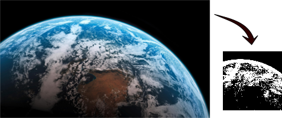

# Composable image algorithms

This section will present another cool feature of *friday*. As I said in the
introduction, the library has the property that you can compose algorithms and
expect them to be fused in a single and efficient loop.

The main motivation when designing this feature was to be able to design complex
but efficient transformations from a small set of simple functions (like `map`).

## The image and function isomorphism

To understand how the compiler and the library are allowed to fuse these
algorithms, one must remember *referential transparency*. Referential
transparency is the property which asserts that pure function calls can be
replaced by the values they generate without changing the output of the program.

This property has an interesting effect on images. Images (and more generally
arrays and vectors), in a pure functional programming context, may be thought of
as functions whose domains are restricted to a contiguous subset of integers
(the valid coordinates of the pixels in the case of an image). In other words,
you can replace the image indexing operator by the function which generates the
pixels of the image *without* changing the output of the program.

The main advantage of considering images as functions instead of arrays is
that functions are composable. Function composability is the idea which propels
the fusion mechanism: *friday* considers images as functions and then composes
them into larger functions.

## A low level image creation interface

Images types implement a type class interface which can be used to build images.

The type class mostly only provides a function to build the image type from a
function. This function's signature looks like this one:

    fromFunction :: FromFunction i
                 => Size -> (Point -> ImagePixel i) -> i

The function accepts the size of the image to create and a function which
generates pixels values from a pair of coordinates. The `FromFunction i`
constraint forces the returned image to be of a type which implements the 
`FromFunction` type class.

You usually don't need to use `fromFunction` directly. Functions like `map`
provide an higher level interface and are implemented using `fromFunction`.

## Two image representations

Two image types implement the previously described `FromFunction` type class.
One is named the **manifest representation** while the other is named the
**delayed representation**.

* The *manifest* representation uses an in memory vector to store the pixels
  values. The vector is entirely initialized when this image is constructed
  with `fromFunction`.
* The *delayed* representation only stores the size and the function which
  constructs the image.

In other words, manifest images are memory resident images while delayed images
are only composed of the function that generate pixel values.

Both image types also implement the `Image` type class which provides an
interface to get pixel values. They can therefore be freely substituted as you
usually only access to these two using this interface.

## Fusing delayed images

Knowing about the manifest and the delayed representations, we can now write a
pipeline of transformations and only have original and the resulting image to
exist in memory.

Let's write a program to create a black and white thumbnail by

1. converting the image to grey-scale.
2. applying our `blackAndWhite` function to convert grey-scale pixels to black
   and white values.
3. removing edges so the image is a square as large as its smallest side.
4. resizing the resulting image to be 100 pixels wide.

If our program is given the image on the left as input, it will generate the
thumbnail on the right:

Here is the source code of the program which created this thumbnail:

    -- Gets the size of the input image.
    (h, w)  = shape input

    -- Gets a grey scale delayed image from the input image.
    grey    = delayed (convert input)

    -- Applies our `blackAndWhite` function to the grey-scale image.
    black   = delayed (blackAndWhite grey)

    -- Creates a rectangle (Rect) object which will be used to define how we
    -- will crop/cut our image and remove edges.
    --
    -- The rectangle is centered on the largest side of the image.
    rect    = if w > h then Rect ((w - h) / 2) 0 h h
                       else Rect 0 ((h - w) / 2) w w

    -- Crops the image.
    cropped = delayed (crop rect black)

    -- Resizes the image.
    --
    -- By using the delayed representations, our compiler should be able to 
    -- fuse these four transformations into a single loop.
    resized = manifest (resize Bilinear (100, 100) cropped)

Notice the use of the two `manifest` and `delayed` functions. These two do
nothing except giving hints to the compiler on what image representation we
want to generate. If we don't write these functions, the *Haskell*'s compiler
will fail and complain that it can't unambiguously determine what image types to
generate.

## Implementation

The *Haskell*'s compiler will generate an efficient loop from the previous
program.

Functions which accept delayed images or which generates delayed images are
requested to be inlined. For the previous example, `convert` will be inlined in
`blackAndWhite`, which will be inlined in `crop`, which will be inlined in
`resize`. The `fromFunction` call inside the `resize` function will also be
inlined. As the `fromFunction` implementation for manifest images is a loop
which calls the pixel generation function for the entire image, and has 

It's quite difficult to figure why this works if you're not used to this kind
of pattern (we ask the compiler to inline functions which receive inline
functions as arguments). But trust me, it does work.

If the function work only on manifest images, it will not be inlined. The
compiler will however be requested to create a specialized instance for the 
requested pixel type(s).

## Mutable images

There is a wide range of image processing algorithms that can't be expressed
efficiently without mutable states (i.e. they can't be efficiently written with
`fromFunction`).

Drawing routines (e.g. drawing a rectangle in an image or the flood fill
algorithm) are such algorithms.

For this reason, *manifest images can be created in a context where mutable
states are allowed*. When in this context, the programmer is able to change
image values exactly as he would do in an imperative programming langage.

Functions written in this context are still deterministic as you can't do side
effect nor use uninitialized variables. A mutable state is also not allowed to
leak outside this context. They appear *pure* from the outside. We rely on the
type checker to enforce this closed containment, by using a functional pattern
named *monads*. Monads are a far too advanced concept to be even introduced in
this document.

Delayed images can't be created in this mutable context. Thus *image 
transformations written this way can't be fused*.
